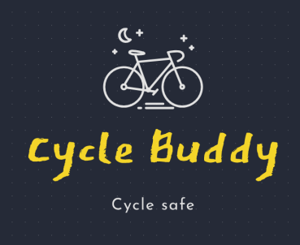
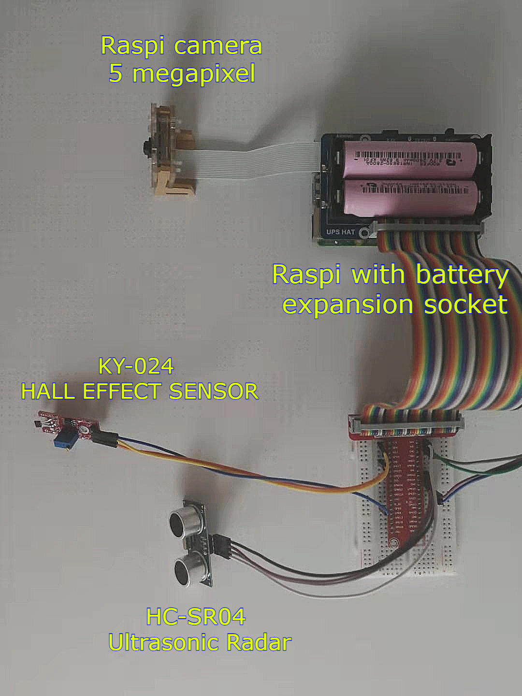
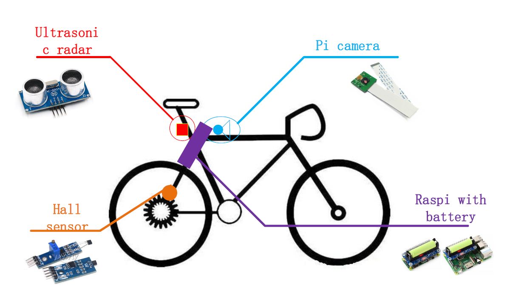
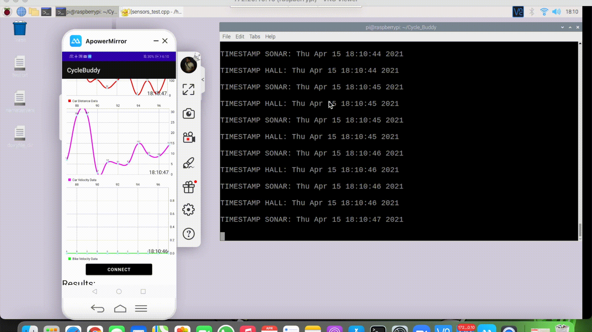
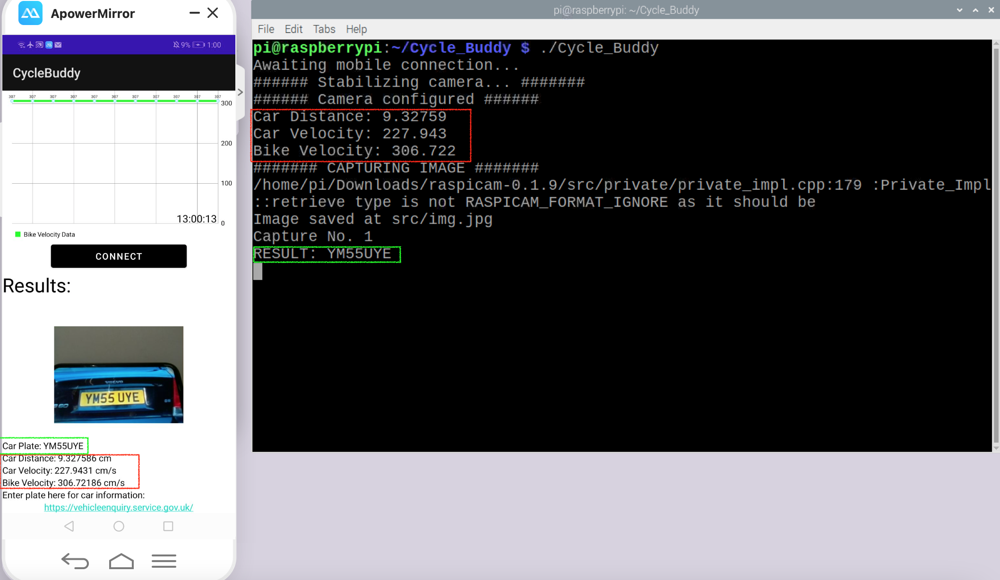

<h2 align="center">Cycle Buddy</h2>  

  <a href="https://github.com/OmarJabri7/Cycle_Buddy">
    ⭐️<a href="https://yifan-xie.github.io/"><strong>Explore Our website»</strong></a>
     
     
    
  </a>
     
     
    ⭐️<a href="https://omarjabri7.github.io/Cycle_Buddy/"><strong>Explore the doxygen»</strong></a>  
  

      <strong>Built by cyclists, for cyclists, keep safe with Cycle Buddy!</strong>
     
     
    <a href="https://www.youtube.com/channel/UC4mHw6LXU8YYIvdZxgI5Btw"></img></a>&nbsp;&nbsp;&nbsp;&nbsp;
    <a href="https://hackaday.io/project/179217-cycle-buddy"></img></a>&nbsp;&nbsp;&nbsp;&nbsp;
    <a href="https://twitter.com/buddy_cycle"></img></a>&nbsp;&nbsp;&nbsp;&nbsp;
     

  

<!-- TOC -->

  
<h2 style="display: inline-block">Contents</h2>

  <ol>
    <li><a href="#about">About</a>
    <li><a href="#software">Software</a></li>
    <li><a href="#hardware">Hardware</a></li>       
    </li>
    <li><a href="#roadmap">Roadmap</a></li>
    <li><a href="#Packages">Packages</a>
    <li><a href="#usage">Usage</a></li>
    <li><a href="#Results & Real-Time Responsiveness">Results & Real-Time Responsiveness</a></li>
    <li><a href="#contributing">Contributing</a></li>
    <li><a href="#license">License</a></li>
    <li><a href="#contact">Contact</a></li>
  </ol>

<!-- Project descirption -->

## About
We are a group of graduate students currently studying at the University of Glasgow.  This github page represents our coursework for Real-Time Embedded Programming Project supervised by Dr. Bernd Porr and Dr. Nicholas Bailey. Our team, is enriched by two members majoring in Robotics & Ai, one member majoring in Electronics and Electrical Engineering. 

Our project, Cycle Buddy, is a system that detects cars that endanger everyday cyclists.  
Once the car overpasses the biker's path with a relative high speed and within a close distance, the system can detect this unjust act and stimulates a camera to capture the car's plate number and recognizes it using a Computer Vision API.  

Then it will send the plate number, its photo and the relevant sensor readings to the mobile application through <b>socket connections</b>, which then stores the proof data in an online real-time database. With those infomation recorded as evidence, the bikers can then use it to contact local law enforcements to report the issue.  

⭐️ [**Doxygen about the project**](https://omarjabri7.github.io/Cycle_Buddy/)

### Circuit of Cycle Buddy: 

  
        
  <b>Figure 1: Indoor circuit of Cycle Buddy</b>    

  
      
  <b>Figure 2: System design concept</b>

   

   

## Software

### Necessary:
* [**Android Studio**](https://developer.android.com/studio)	(**Mobile Phone Application**) 

  ​	Android Studio provides the fastest tools for building apps on every type of Android device. We use it for connecting the raspberry pi and get real-time information from the raspberry pi, such as car distance, car velocity, and bike velocity.

* [**Visual Studio 2019**](https://visualstudio.microsoft.com/zh-hans/vs/)    (**Raspberry pi threads**) 

  ​	Visual Studio 2019 has the latest features to bring real-time collaboration so it is convenient for us to write C++ code for their project.

* [**Firebase**](https://firebase.google.com/)    (**Real time database**) 

  ​	Firebase is Google’s mobile application development platform that helps you build, improve, and grow your app. It manages our data and stores our license plate numbers which are from the Pi camera.

* [**Cmake**](https://cmake.org/)    (**Build up the full project**) 

  ​	CMake is used to control the software compilation process using simple platform and compiler independent configuration files, and generate native makefiles and workspaces that can be used in the compiler environment of our choice.

* [**Doxygen**](https://www.doxygen.nl/index.html)    (**document generation tool**) 

  ​	Doxygen is a document generation tool that extracts documents from code, organizes them, and outputs them into beautiful documents (HTML, PDF, RTF, etc.).

  ​	With the Doxygen tool, programmers can write code directly in the document, no longer need to write a separate document for a function of the code, thus keeping the document and code as consistent as possible.

*  [**OpenALPR - Automatic License Plate Recognition**](https://www.openalpr.com/) (**API**)

  ​	This API can recognize the license plate number directly from the picture, we find a GB (Great Britain, UK) lib trained model and use it.

### Optional: 
* Putty

  ​	Simplifies SSH connections to the Raspberry Pi.

* VNC (Other Remote Desktop Services are also fine) 

  ​	Use ssh services to log in to the raspberry pi so that we do not need to use HDMI or screen to connect to the raspberry pi. It is also convenient to use UI to code in raspberry pi.

*  Typora 

  ​	Edit markdown and Html files for Doxygen and web page in a clear setup.

* [**Search for the car information**](https://vehicleenquiry.service.gov.uk/?_ga=2.97692959.1629293611.1618412250-1021591735.1618412250)

  ​	Here is the government website to search for the car information, so when we get the license plate number, we can extract the car information to alert  the authorities.
   

## Hardware
### Main device:
* [Raspberry Pi 3 Model B +](https://thepihut.com/products/raspberry-pi-3-model-b-plus?src=raspberrypi) (￡33.90, **1** is needed, not included)

  ​	The Raspberry Pi 3 Model B is the earliest model of the third-generation Raspberry Pi. In our project, It can receive the real-time signals of the GPIO from all the sensors and deal with the real-time data.

### Sensors:
* [Hall sensor](https://www.amazon.co.uk/AZDelivery-Linear-Magnetic-Sensor-Arduino/dp/B07DPVTKBB/ref=sr_1_4_sspa?dchild=1&keywords=Hall+Effect+Sensor&qid=1618406619&sr=8-4-spons&psc=1&spLa=ZW5jcnlwdGVkUXVhbGlmaWVyPUEyV1lEMzJNSUE5S1A4JmVuY3J5cHRlZElkPUEwMjc5ODE1MTI4TUc5SFI1R0gxUSZlbmNyeXB0ZWRBZElkPUEwMDIzNjQwMTkzSk03UDI4WFdROSZ3aWRnZXROYW1lPXNwX2F0ZiZhY3Rpb249Y2xpY2tSZWRpcmVjdCZkb05vdExvZ0NsaWNrPXRydWU=) (￡4.49, **1** is needed)

  ​	We use a hall sensor to detect the velocity of the bike. The theory is to put the magnets on the axle of the bicycle wheel. Make sure the hall sensor is close to magnets enough so that it can detect the magnetic field when the bike runs. Hence estimating the bike's velocity from the rotations of the wheel.

* [Ultrasonic sensor](https://www.amazon.co.uk/HC-SR04-Ultrasonic-Distance-Measuring-Arduino/dp/B01DM8MRTS/ref=sr_1_7?dchild=1&keywords=Ultrasonic+Sensor&qid=1618407336&sr=8-7)（￡3.99,  **1** is needed)

  ​	The Ultrasonic sensor is to detect the distance between the bicycle and car. Alongside, calculating the velocity of the incoming car by differentiating its position.

* [Pi camera](https://www.amazon.co.uk/dp/B07XBKC6H7/ref=cm_sw_r_u_apa_glt_fabc_74TKMY2AH1HFZ4SVKC7J) （￡10.99, **1** is needed) 

  ​	The Pi camera is used to capture the picture of the car plate. We found a feasible location for the Pi camera so that it has a strategic point to always capture a clear view of the plate number.

### Other auxiliary tools :

* Male/Male, Female/Female and Male/Female wires ，magnets (approximately ￡ 2.34)
* GPIO Breakout Kit Expansion Board For Raspberry Pi 3 B+ (￡14.49)
* Power supply for Raspberry Pi or Power bank. (￡ 13.56)

​	**Overall**, it costs us ￡49.86 except the **Raspberry Pi 3 Model B +** for the project.
   

## Roadmap
See the [open issues](https://github.com/OmarJabri7/Cycle_Buddy/issues) for a list of proposed features (and known issues).

### Threading Pipeline 
The system is split into three threads:
1. Main Thread that extracts information from the remaining threads and sends them to the mobile application
2. Ultrasonic Sensor thread, event driven thread that captures readings from the sensor and sends the data through a socket connection to the application which plots it in real time.
3. Hall Effect Sensor thread, event driven thread that captures readings from the sensor and sends the data through a socket connection to the application which plots it in real time.
  

## Package Prerequisites
* WiringPi 
* Raspicam
* OpenALPR
* JSON
* Cmake
* Pyrebase
  

### Packages Installations
Before install any packages, please run the following: 
sudo apt-get update && upgrade 
1. [**WiringPi**](http://wiringpi.com/): 
   `sudo apt-get install wiringpi` 
2. [**Raspicam**](https://sourceforge.net/projects/raspicam/files/) : (For Pi camera) 
  Download folder from that link and: 
   a. `tar xvzf raspicamxx.tgz` 
   b. `cd raspicamxx` 
   c. `mkdir build` 
   d. `cd build` 
   e. `cmake ..` 
   f. `make`  
   g. `sudo make install`  
   
3. [**OpenALPR**](https://github.com/openalpr/openalpr):  (Github page) 
   `sudo apt-get update && sudo apt-get install -y openalpr openalpr-daemon openalpr-utils libopenalpr-dev` 
4. [**JSON Library**](https://github.com/nlohmann/json):  (Github page) 
   `sudo apt-get install -y nlohmann-json-dev` 
   If the above method does not work, please try the following: 
   a.`git clone https://github.com/nlohmann/json.git` 
   b.`cd json` 
   c.`mkdir build` 
   d.`cd build` 
   e.`cmake ..` 
   f.`make` 
   g.`sudo make install`

5. [**Cmake**](https://cmake.org/) : (Website) 

   Click and download it from the website above.
6. [**Pyrebase**](https://github.com/thisbejim/Pyrebase): Github page 
    `pip3 install pyrebase`  
    `pip install pyrebase` 
7. Android APK File:  
    Just download the [Android Application](CycleBuddyApp.apk) onto your phone and enjoy!

## Usage
This project is built using Cmake and Makefiles in order to allow users to easily run our code and tets it. 
Please follow these necessary steps:  
1. Clone the project with:  
    `git clone https://github.com/OmarJabri7/Cycle_Buddy.git` 
2. Change directorites and relocate in Cycle_Buddy project:  
    `cd Cycle_Buddy` 
3. Make Build directory containing all executables:  
    `mkdir build && cd build`
4. Link the necessary executables and libraries using CMake (in build dir):  
    `cmake ..` 
5. Build the project using make (in build dir):  
     `make` 
6. Before Testing and Running the system:  
    Be sure to either use our GPIO setup, or change to your own in:  
    [GPIO numbering](src/gpio_def.h)
7. Generate Unit tests and check if all components pass (in build dir): 
   `make test` 
8. Go to main directory:
    `cd ..`
9. Make sure you have permissions to execute run.sh:  
    `chmod +x run.sh`
11. Run the bash script labeled run.sh:  
    `./run.sh` 
     
<b>Youtube Links</b>:  
[**How to setup the system**](https://youtu.be/hLp1nWcYq-g) 
[**How to run the system (full flow of execution example)**](https://www.youtube.com/watch?v=jFNNWsNNDZw)
   

## Results & Real-Time Responsiveness:
1. The Gif below demonstrates the real time nature of the system, where each sensor reading is sent to the android application and plotted in real time:
  

    
          
    <b>Figure 3: Real time demo</b>    
  

* It is clear to note how the timestamp emerging from the raspberry pi is the same as the one displayed in the android app. This reinforces the real-time responsiveness of our system.

  

2. The image below demonstrates how the system triggers the Pi Camera to capture an image of the car plate and recognizes it using the OpenAlpr API:
     

  <b>Figure 4: Indoor and Outdoor results</b>

 

* On the left, we have the results from the indoor testing, where the car plate is displayed on a phone screen. 

* On the right, we have the results from the outdoor testing, where the car plate is captured by the camera on the streets of Glasgow. 

* Moral of the story is, that the api is capable enough to recognize the car plates within any environment. Moreover, the data displayed under the Car Plate are the sensor readings at the instant of capturing the image. Thus, ensuring that the system operates in real time.
    

3. The final thing to notice is how the system saves the relevant data once the image is captured, reinforcing the idea of a real-time embedded system:

    
          
    <b>Figure 5: Real time & Results snapshot</b>    
  

* Notice how the car plate is equivalent (green square), alongside car distance, velocity and bike velocity (red square).
   
<!-- Contributing -->

## Contributing
This is an open-source project, therefore, just fork it and build up the project according to the README.md in every document.
   

<!-- License -->
## License
Distributed under the GPL-3.0 License. See [`LICENSE`](https://github.com/OmarJabri7/Cycle_Buddy/blob/main/LICENSE) for more information.
   

<!-- Contact Info -->
## Contact

* System build: Omar Jabri - [@Omar Jabri](https://github.com/OmarJabri7)
 

* System design: Chang Liu - [@Chang Liu](https://github.com/Cliu1993)
 

* System intergation: Yifan Xie - [@Yifan Xie](https://github.com/Yifan-Xie)
 

⭐️ **Project address** - [@Project address](https://github.com/OmarJabri7/Cycle_Buddy)
  

⭐️ **Project address** - [@Cycle Buddy Website](https://yifan-xie.github.io/)

